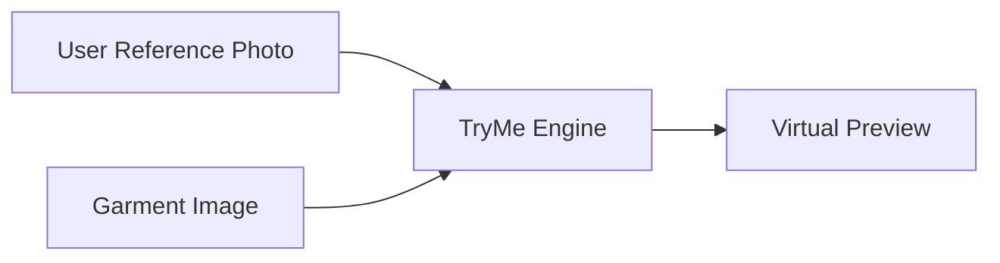
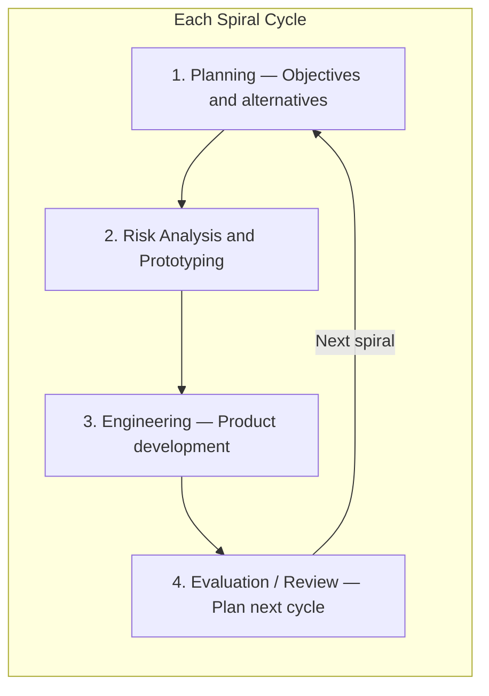
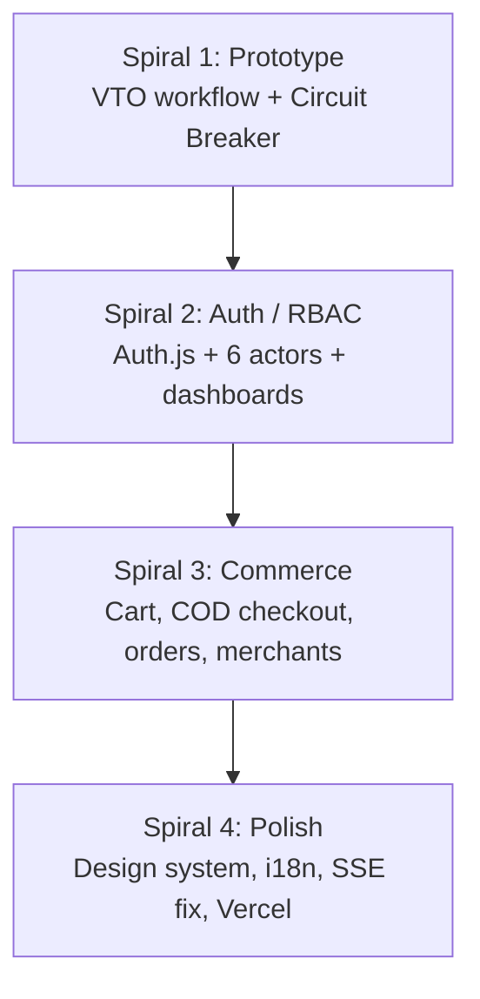
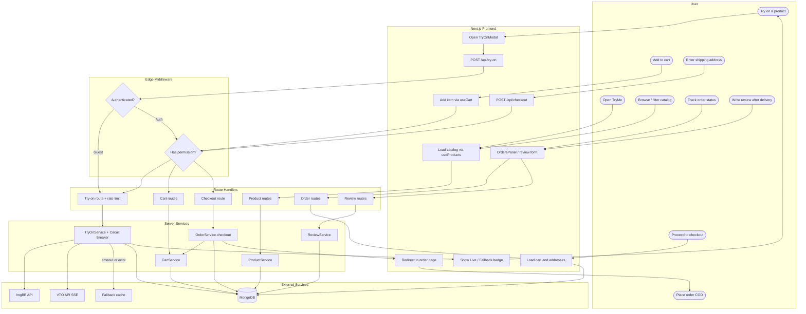
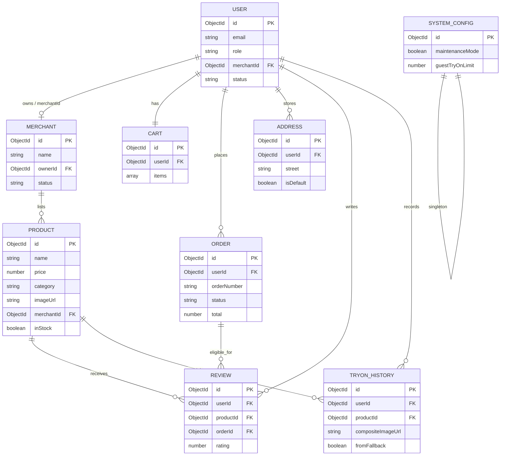
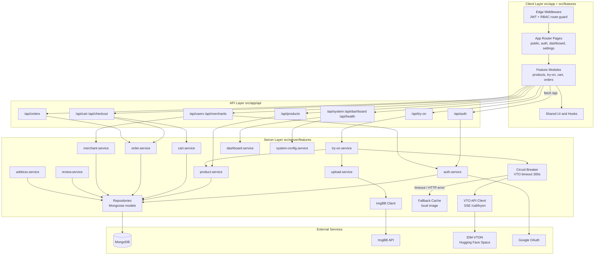
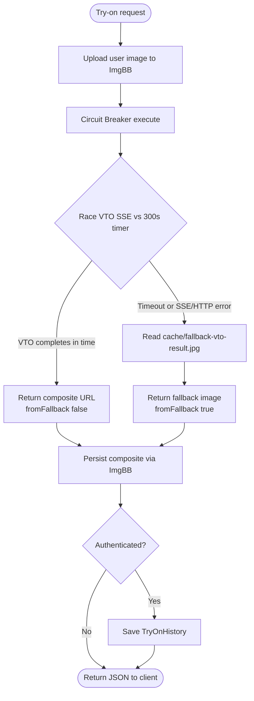
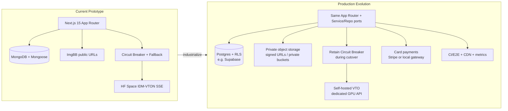

```mermaid
flowchart TB
    Guest(("Guest"))
    Customer(("Customer"))
    Merchant(("Merchant"))
    Support(("Support Staff"))
    Admin(("Admin"))
    SuperAdmin(("Super Admin"))

    subgraph TryMe["TryMe System"]
        direction TB

        subgraph Catalog["Catalog and Try-On"]
            UC1(["Browse Product Catalog"])
            UC2(["Filter by Category"])
            UC3(["Virtual Try-On"])
            UC4(["View Try-On History"])
            UC5(["Identify Live vs Fallback"])
        end

        subgraph Commerce["Commerce"]
            UC6(["Manage Cart"])
            UC7(["Checkout COD"])
            UC8(["Track Orders"])
            UC9(["Write Product Review"])
            UC10(["Manage Addresses"])
        end

        subgraph Account["Account"]
            UC11(["Register / Sign In"])
            UC12(["Google OAuth"])
            UC13(["Manage Profile and Preferences"])
        end

        subgraph MerchantOps["Merchant Operations"]
            UC14(["Manage Products"])
            UC15(["View Merchant Analytics"])
            UC16(["Manage Store Profile"])
        end

        subgraph AdminOps["Administration"]
            UC17(["Manage Users and Roles"])
            UC18(["Manage Merchants"])
            UC19(["View Platform Stats"])
            UC20(["System Config and Maintenance"])
            UC21(["Assume Role Super Admin"])
        end
    end

    ImgBB(("ImgBB API"))
    VTO(("VTO API"))
    MongoDB(("MongoDB"))
    Google(("Google OAuth"))

    Guest --> UC1
    Guest --> UC2
    Guest --> UC3
    Guest --> UC11

    Customer --> UC1
    Customer --> UC3
    Customer --> UC4
    Customer --> UC6
    Customer --> UC7
    Customer --> UC8
    Customer --> UC9
    Customer --> UC10
    Customer --> UC11
    Customer --> UC12
    Customer --> UC13

    Merchant --> UC14
    Merchant --> UC15
    Merchant --> UC16
    Merchant --> UC8

    Support --> UC4
    Support --> UC8
    Support --> UC17
    Support --> UC19

    Admin --> UC17
    Admin --> UC18
    Admin --> UC19
    Admin --> UC20

    SuperAdmin --> UC21

    UC2 -.->|extends| UC1
    UC5 -.->|extends| UC3
    UC7 -.->|includes| UC6
    UC9 -.->|includes| UC8
    UC12 -.->|extends| UC11

    UC1 --> MongoDB
    UC3 --> ImgBB
    UC3 --> VTO
    UC3 --> MongoDB
    UC7 --> MongoDB
    UC11 --> MongoDB
    UC12 --> Google
```

# Ultimate Claude Prompt — TryMe Defense Slides

Copy everything from the line **BEGIN PROMPT** through **END PROMPT** into Claude.

---

## BEGIN PROMPT

You are an expert academic presentation designer for a university software-engineering thesis defense. Generate a complete **11-slide** defense deck for the project **TryMe**.

You have **no access** to any codebase. Treat every fact, bullet, speaker note, and diagram in this prompt as the **only source of truth**. Do not invent alternate tech stacks, timeouts, actors, or architectures.

### Output requirements

1. Produce **exactly 11 slides**, numbered Slide 1–Slide 11, in order.
2. For each slide, output:
   - **Slide title**
   - **Speaker** (who presents this section)
   - **Layout / visual direction** (how Claude or a slide tool should compose the slide)
   - **On-slide text** (exact wording to place on the slide — do not paraphrase bullets)
   - **Diagram** (Mermaid code block when provided — render it as the main visual; do not replace with a different diagram)
   - **Speaker notes** (2–4 short talking points for oral defense)
3. Preferred deliverable formats (produce both if you can):
   - A slide-by-slide markdown specification (as above)
   - If you can generate slides (PPTX / Google Slides / HTML deck), do so using this content; otherwise provide the markdown spec clearly enough that another tool can build the deck 1:1
4. Visual style: **plain white / off-white backgrounds**, minimalist academic branding, high contrast dark text, clean sans or restrained serif for titles only. **No** purple-to-indigo AI gradients, **no** neon glow, **no** emoji-heavy decoration, **no** cluttered dashboard layouts. One idea per slide. Generous whitespace.
5. Where Mermaid is provided, **use that Mermaid verbatim** (you may only fix syntax if a renderer rejects it — never change meaning).
6. Do **not** say the timeout is 10 seconds. The circuit-breaker timeout is **300 seconds (5 minutes)**.
7. Do **not** claim a standalone Express server exists. The system is a **unified Next.js 15 App Router** application.

### Project facts (lock these in)

- **Product:** TryMe — Enterprise Virtual Try-On Architecture
- **Institution:** Sonargaon University — Team Defense (10th-semester presentation standard)
- **Speakers by part:**
  - Part 1 (Slides 1–3): **Sadman** — Product & Business Value
  - Part 2 (Slides 4–7): **Yuvraj** — Systems Analysis & Modeling
  - Part 3 (Slides 8–11): **Bijoy** — Architecture, Resilience & Roadmap
- **Stack:** Next.js 15 App Router, React, TypeScript, MongoDB + Mongoose, ImgBB (image hosting), IDM-VTON via Hugging Face Spaces (Gradio SSE `/call/tryon`), Auth.js / NextAuth, Google OAuth, Vercel deploy
- **Guest try-on rate limit:** 3 requests per hour (IP-scoped for guests)
- **Layering rule:** Route Handler → Service → Repository → Mongoose Model
- **Actors (6):** Guest, Customer, Merchant, Support Staff, Admin, Super Admin
- **SDLC:** Spiral Model (Evolutionary Prototyping), risk-driven
- **Four delivered spirals:** 1. Prototype, 2. Auth/RBAC, 3. Commerce, 4. Polish
- **Resilience:** Circuit breaker races VTO call against **300s** timeout; on timeout/error serves local fallback image `cache/fallback-vto-result.jpg` and flags `fromFallback: true`

---

## SLIDE 1 — Title Slide
**Speaker:** Sadman

**Layout / visual direction:**
- Full plain white background
- Minimalist branding only
- Product name is the hero signal (largest text on the slide)
- Subtitle and institution secondary
- No diagrams, no icons row, no stats

**On-slide text:**
- **TryMe: Enterprise Virtual Try-On Architecture**
- Team Defense — Sonargaon University

**Speaker notes:**
- Introduce the team and the product name
- State that TryMe closes the online-retail visualization gap with AI virtual try-on
- Preview the three parts of the defense: product value → modeling → architecture/resilience

---

## SLIDE 2 — The Market Problem
**Speaker:** Sadman

**Layout / visual direction:**
- Highly simplified **split-screen** composition
- Left: icon/graphic for **Uncertain Fit** (shopper unsure how a garment looks on them)
- Right: icon/graphic for **High Return Rates** (return package / reverse logistics)
- Three short bullets centered or beneath the split
- No cards stacked with stats; keep it sparse

**On-slide text:**
- Visualization gap in online retail
- High reverse-logistics costs
- Conversion friction

**Speaker notes:**
- Online shoppers cannot mentally map flat product photos to their body
- Returns create shipping, restocking, and markdown costs
- Friction at the confidence step kills conversion before checkout

---

## SLIDE 3 — The TryMe Solution & User Flow
**Speaker:** Sadman

**Layout / visual direction:**
- Dominant high-level user flow diagram (use the Mermaid below)
- Two supporting bullets under or beside the flow
- Emphasize frictionless guest path then conversion to authenticated customer

**On-slide text:**
- Frictionless guest experience (Rate-limited: 3/hr)
- Seamless conversion to authenticated customer

**Diagram (Mermaid — render as primary visual):**



**Speaker notes:**
- Guest can try on without signing up, capped at 3/hour to protect free-tier AI capacity
- Authenticated customers get history, cart, checkout, and full commerce
- Output is a composite preview: person + selected garment

---

## SLIDE 4 — Software Development Life Cycle (SDLC)
**Speaker:** Yuvraj

**Layout / visual direction:**
- Spiral / evolutionary process diagram as the hero visual
- Highlight the **four project spirals** by name
- Supporting bullets on evolutionary prototyping and risk-driven method

**On-slide text:**
- Evolutionary Prototyping
- Risk-driven methodology
- Spirals: 1. Prototype, 2. Auth/RBAC, 3. Commerce, 4. Polish

**Diagram A — one cycle of the spiral (Mermaid):**



**Diagram B — four delivered spirals (Mermaid — place below or as callouts):**



**Speaker notes:**
- Spiral chosen because VTO API risk was unknown — validate resilience before commerce
- Each spiral ends with a working, deployable increment
- Example risk: Spiral 1 VTO downtime → Circuit Breaker + fallback cache built first

---

## SLIDE 5 — Behavioral Modeling
**Speaker:** Yuvraj

**Layout / visual direction:**
- UML-style **Use Case** diagram fills most of the slide (use Mermaid below)
- Short bullets stating system boundary and six actors
- Keep labels readable; if rendering is dense, slightly enlarge actor nodes

**On-slide text:**
- System boundaries defined
- 6 Distinct Actors: Guest, Customer, Merchant, Support, Admin, Super Admin

**Diagram (Mermaid — use verbatim):**



**Speaker notes:**
- Primary actors are the six human roles; ImgBB, VTO, MongoDB, Google are secondary
- Guest is anonymous (browse + rate-limited try-on); Customer owns commerce
- Super Admin uniquely assumes roles for testing via UC21

---

## SLIDE 6 — Dynamic State & Workflow
**Speaker:** Yuvraj

**Layout / visual direction:**
- UML Activity / **Swimlane** diagram as the full-bleed visual
- Emphasize parallel paths: image upload (ImgBB), VTO inference, database persistence
- Bullets call out parallel control and async I/O

**On-slide text:**
- Parallel control logic
- Asynchronous image storage and database querying

**Diagram (Mermaid — use verbatim):**



**Speaker notes:**
- Swimlanes show who owns each step: User, Frontend, Middleware, API, Services, External
- Try-on path fans out to ImgBB upload, VTO SSE, and optional history write to MongoDB
- Circuit breaker guarantees a preview even when VTO times out or errors

---

## SLIDE 7 — Data Architecture
**Speaker:** Yuvraj

**Layout / visual direction:**
- Physical **ER-style** diagram of MongoDB/Mongoose collections
- Emphasize optimized references among User, Product, Order, TryOnHistory
- Bullets under the diagram

**On-slide text:**
- MongoDB (Mongoose) physical collections
- Optimized relational references (User, Product, Order, TryOnHistory)

**Diagram (Mermaid ER — use verbatim):**



**Speaker notes:**
- Physical collections map 1:1 to Mongoose models
- TryOnHistory optionally links a user and always references a product; `fromFallback` records resilience path
- SystemConfig is a singleton controlling guest limit and maintenance mode

---

## SLIDE 8 — Component Architecture
**Speaker:** Bijoy

**Layout / visual direction:**
- Structural **component diagram** as the main visual
- Call out unified Next.js 15 App Router (no standalone Express)
- Show feature-based layering: Route Handlers → Services → Repositories

**On-slide text:**
- Unified Next.js 15 App Router (No standalone Express server)
- Feature-based directory structure (Route Handlers → Services → Repositories)

**Diagram (Mermaid — use verbatim):**



**Speaker notes:**
- One deployable Next.js app owns UI, middleware, and API route handlers
- Business logic never lives in route files — services orchestrate; repositories isolate MongoDB
- External AI and image hosts are isolated behind clients + circuit breaker

---

## SLIDE 9 — Algorithmic Fault Tolerance
**Speaker:** Bijoy

**Layout / visual direction:**
- **Two-column slide:** left = Circuit Breaker flowchart; right = execution pseudocode
- Stress that this mitigates third-party API latency/failure
- Exact timeout: **300 seconds** trips to local cache fallback

**On-slide text:**
- Mitigates third-party API network latency
- 300-second timeout trips circuit to serve local cache fallback

**Diagram — Circuit Breaker flowchart (Mermaid):**



**Pseudocode (place on slide exactly):**

```
execute(operation):
  try:
    result = race(operation(), timeout(300_000 ms))
    return { data: result, fromFallback: false }
  catch:
    fallback = read("cache/fallback-vto-result.jpg")
    return { data: fallback, fromFallback: true }
```

**Speaker notes:**
- Free-tier Hugging Face Spaces are slow and can fail mid-SSE stream
- Timeout is configurable via `VTO_TIMEOUT_MS`; default is 300000 ms (5 minutes), aligned with route `maxDuration = 300`
- UI shows a Live vs Fallback badge so demos remain honest and always produce a result

---

## SLIDE 10 — Critical Security Analysis
**Speaker:** Bijoy

**Layout / visual direction:**
- Three equal columns with **minimal icons** only:
  1. API / shared compute
  2. Cloud storage
  3. Privacy / compliance
- One short heading + one short supporting line per column
- No fear-mongering graphics; academic tone

**On-slide text (three columns):**

**API Vulnerabilities**
- Shared compute space risks (e.g., prompt / input injection on third-party inference hosts)

**Storage Instability**
- ImgBB latency spikes and public-URL hosting dependency

**Data Compliance**
- Third-party transmission of personal photos (user reference images leave the app boundary)

**Speaker notes:**
- VTO runs on shared Hugging Face infrastructure — trust and isolation are limited
- ImgBB is a free host: availability and data-retention guarantees are weak for production PII imagery
- Production hardening requires private storage, contractual AI hosts, and explicit consent/retention policy

---

## SLIDE 11 — Future Roadmap
**Speaker:** Bijoy

**Layout / visual direction:**
- Forward-looking architecture diagram: **current stack on the left**, **productionized target on the right**
- Phrase as how the **industry / a production retail deployment** would mature this working prototype — concrete engineering steps, not vague slogans
- Three phased bullets under the diagram

**On-slide text:**
- Infrastructure sovereignty for production retail VTO
- Supabase (Postgres + RLS + private buckets) replacing MongoDB public-ImgBB coupling
- Self-hosted open-source VTO on dedicated GPU clusters replacing free Hugging Face Spaces
- Near-term productization: Stripe (or regional gateway), CI/E2E, CDN caching, VTO latency observability

**Diagram (Mermaid — current → target):**



**How it would be done (require Claude to keep these as speaker-note depth; shorten on-slide if needed):**

1. **Data & media sovereignty**
   - Introduce repository adapters for Postgres while keeping Route Handler → Service → Repository unchanged
   - Enable Row Level Security keyed by `userId` / `merchantId` / role claims from Auth.js JWT
   - Move user photos and composites from ImgBB public links to private buckets; issue time-limited signed URLs to the browser
2. **AI inference control**
   - Containerize an open-source VTON model on a GPU node (Docker/Kubernetes)
   - Expose an internal HTTP/SSE-compatible API; point `VTO` client env URL at the private endpoint
   - Keep the existing 300s circuit breaker + local fallback as the safety net during migration and capacity incidents
3. **Payments & operations**
   - Replace COD-only checkout with Stripe (or a regional PSP) behind the existing payment-provider interface
   - Add automated unit/E2E tests and CI on every merge; CDN-cache catalog images; measure Live vs Fallback rate and p95 VTO latency

**Speaker notes:**
- Frame as productionization of a validated Spiral-4 prototype, not as unfinished homework
- Emphasize that the layered architecture was designed so storage and AI hosts are swappable without rewriting the UI
- Circuit breaker remains valuable even after self-hosting — GPUs still fail and queue

---

## Final instructions to Claude

- Generate the full 11-slide deck from this specification.
- Preserve exact bullet wording unless a slide tool’s character limit forces a trivial abbreviation — if so, note the abbreviation.
- Render every Mermaid diagram; if a slide tool cannot run Mermaid, export each diagram as a clear vector/PNG via mermaid.live-equivalent rendering and embed the image.
- After the slides, optionally append a one-page **defense Q&A cheat sheet** with short answers for: why Spiral, why 300s timeout, why fallback is a feature, why no Express, guest 3/hr, six actors.
- Do not contradict any locked fact in this prompt.

## END PROMPT
