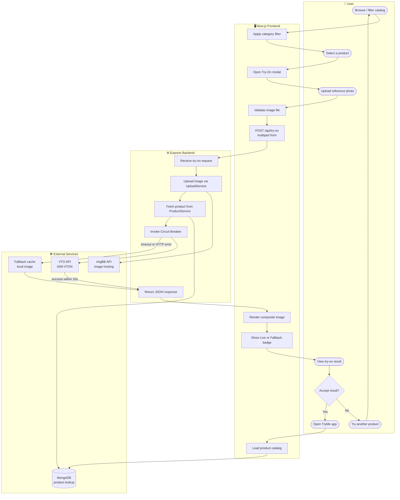

# Activity / Swimlane Diagram — Virtual Try-On Flow

End-to-end process flow partitioned by responsible lane.

## Lane Responsibilities

| Lane | Activities |
|------|------------|
| **User** | Navigation, product selection, photo upload, result review |
| **Next.js Frontend** | Catalog rendering, client validation, API calls, result display |
| **Express Backend** | Request orchestration, service delegation, circuit-breaker logic |
| **External Services** | Persistent catalog, image storage, AI try-on, fallback resilience |

## Decision Points

1. **Image validation (Frontend)** — Rejects invalid files before hitting the API.
2. **Circuit Breaker (Backend → External)** — On VTO timeout (>10 s) or HTTP error, serves pre-cached fallback image instead of failing the request.
3. **User acceptance** — Shopper may retry with a different product or restart the session.

[← Diagram index](diagrams.md)
