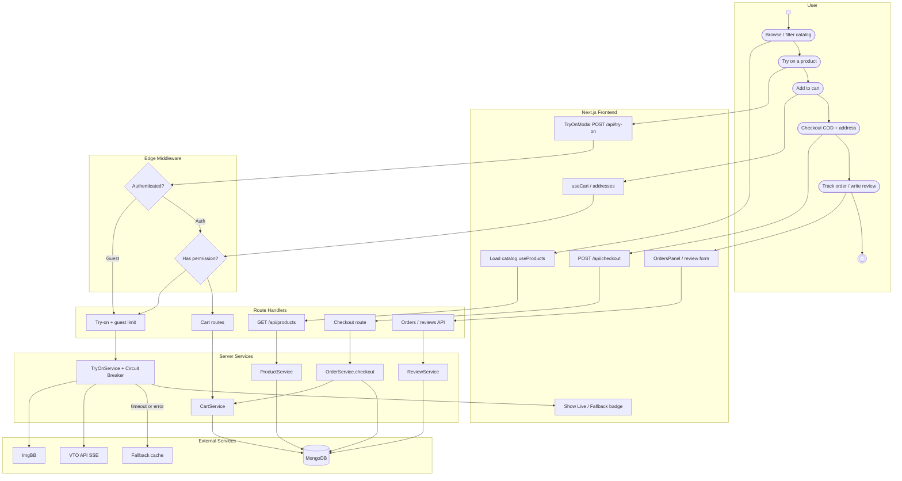

# Activity / Swimlane Diagram — End-to-End Commerce & Try-On

UML activity diagram with **horizontal swimlanes** (partitions). Shows browse → try-on → cart → checkout → track/review across responsible layers.

## Open this for the panel slide

**[tryme-activity-swimlane.drawio](drawio/tryme-activity-swimlane.drawio)** — page **1100×411** (11″ wide × 4.11″ tall), black ink.

| UML element | In the `.drawio` |
|-------------|------------------|
| Page size | Exact slide slot: `pageWidth=1100`, `pageHeight=411` |
| Partitions | Six horizontal swimlanes (≈68px each) spanning full width |
| Initial / final | Filled circle → double-circle |
| Actions | Compact rounded rectangles (left→right phases) |
| Decisions | Diamonds (`Auth?`, `Perm?`) |
| Parallel I/O | TryOn + CB → ImgBB, VTO SSE; dashed timeout → Fallback |
| Control flow | Solid arrows with filled arrowheads |

### Lanes

| Lane | Responsibility |
|------|----------------|
| **User** | Browse, try-on, cart, COD checkout, track / review |
| **Next.js Frontend** | Hooks, TryOnModal, badges, forms, API calls |
| **Edge Middleware** | Auth + permission gates |
| **Route Handlers** | HTTP boundary (`/api/products`, try-on, cart, checkout, orders) |
| **Server Services** | Product / TryOn (+ circuit breaker) / Cart / Order / Review |
| **External Services** | MongoDB, ImgBB, VTO SSE, local fallback cache |

### Export for PowerPoint

1. Open in [diagrams.net](https://app.diagrams.net/) or the Draw.io extension.
2. **File → Export as → PNG/SVG**, transparent background.
3. Place on Slide 6 in the **11″ × 4.11″** slot (1:1 with the Draw.io page).

## Mermaid (reference / Copy Mermaid only)

Mermaid cannot render true UML swimlane partitions. Prefer the `.drawio` for defense.

Interactive sketch: [html/activity-swimlane-diagram.html](html/activity-swimlane-diagram.html)

```mermaid
flowchart TB
    subgraph UserLane["User"]
        U0(( ))
        U1([Browse / filter catalog])
        U2([Try on a product])
        U3([Add to cart])
        U4([Checkout COD + address])
        U5([Track order / write review])
        U6((( )))
    end
    subgraph Frontend["Next.js Frontend"]
        F1[Load catalog useProducts]
        F2[TryOnModal POST /api/try-on]
        F3[Show Live / Fallback badge]
        F4[useCart / addresses]
        F5[POST /api/checkout]
        F6[OrdersPanel / review form]
    end
    subgraph Middleware["Edge Middleware"]
        MW1{Authenticated?}
        MW2{Has permission?}
    end
    subgraph API["Route Handlers"]
        R1[GET /api/products]
        R2[Try-on + guest limit]
        R3[Cart routes]
        R4[Checkout route]
        R5[Orders / reviews API]
    end
    subgraph Server["Server Services"]
        S1[ProductService]
        S2[TryOnService + Circuit Breaker]
        S3[CartService]
        S4[OrderService.checkout]
        S5[ReviewService]
    end
    subgraph External["External Services"]
        E1[(MongoDB)]
        E2[ImgBB]
        E3[VTO API SSE]
        E4[Fallback cache]
    end
    U0 --> U1 --> F1 --> R1 --> S1 --> E1
    U1 --> U2 --> F2 --> MW1
    MW1 -->|Guest| R2
    MW1 -->|Auth| MW2 --> R2
    R2 --> S2
    S2 --> E2
    S2 --> E3
    S2 -->|timeout or error| E4
    S2 --> F3
    U2 --> U3 --> F4 --> MW2 --> R3 --> S3 --> E1
    U3 --> U4 --> F5 --> R4 --> S4
    S4 --> S3
    S4 --> E1
    U4 --> U5 --> F6 --> R5 --> S5 --> E1
    U5 --> U6
```

## Decision points (oral defense)

1. **Guest vs authenticated** — Guests hit rate-limited try-on; cart/checkout require auth + permission.
2. **Circuit breaker** — VTO timeout/error → local fallback; UI shows Live vs Fallback badge.
3. **Checkout** — `OrderService` uses cart + MongoDB; COD only.
4. **Review** — Requires delivered purchase (enforced in `ReviewService`).

[← Diagram index](README.md)
