# Class Diagram — TryMe (Current)

Domain models, server service layers, auth/RBAC, and key frontend types.

```mermaid
classDiagram
    direction TB

    %% ── Domain Models ──
    class User {
        <<Mongoose Model>>
        +String email
        +String passwordHash
        +String name
        +UserRole role
        +ObjectId merchantId
        +UserStatus status
        +UserPreferences preferences
    }

    class Product {
        <<Mongoose Model>>
        +String name
        +Number price
        +ProductCategory category
        +String imageUrl
        +String[] sizes
        +CustomField[] customFields
        +Boolean inStock
        +Number stockQuantity
        +ObjectId merchantId
    }

    class Merchant {
        <<Mongoose Model>>
        +String name
        +ObjectId ownerId
        +MerchantStatus status
    }

    class Cart {
        <<Mongoose Model>>
        +ObjectId userId
        +CartItem[] items
    }

    class Order {
        <<Mongoose Model>>
        +ObjectId userId
        +String orderNumber
        +OrderStatus status
        +OrderItem[] items
        +ShippingAddress shippingAddress
        +Number total
    }

    class Address {
        <<Mongoose Model>>
        +ObjectId userId
        +String street
        +Boolean isDefault
    }

    class Review {
        <<Mongoose Model>>
        +ObjectId userId
        +ObjectId productId
        +ObjectId orderId
        +Number rating
        +String comment
    }

    class TryOnHistory {
        <<Mongoose Model>>
        +ObjectId userId
        +ObjectId productId
        +String compositeImageUrl
        +Boolean fromFallback
    }

    class SystemConfig {
        <<Mongoose Model>>
        +Boolean maintenanceMode
        +Number guestTryOnLimit
    }

    %% ── Repositories ──
    class UserRepository {
        +findById(id) User
        +findByEmail(email) User
        +create(data) User
        +update(id, data) User
    }

    class ProductRepository {
        +findAll(filters) Product[]
        +findById(id) Product
        +create(data) Product
        +update(id, data) Product
        +delete(id) void
    }

    class CartRepository {
        +findByUserId(userId) Cart
        +upsert(userId, items) Cart
    }

    class OrderRepository {
        +findByUserId(userId) Order[]
        +create(data) Order
        +updateStatus(id, status) Order
    }

    class TryOnHistoryRepository {
        +findByUserId(userId) TryOnHistory[]
        +create(data) TryOnHistory
        +delete(id) void
    }

    %% ── Services ──
    class AuthService {
        +register(data) User
        +findOrCreateOAuthUser(profile) User
        +validateCredentials(email, password) User
    }

    class ProductService {
        +getProducts(filters) Product[]
        +getProductById(id) Product
        +createProduct(data) Product
    }

    class TryOnService {
        +processTryOn(file, productId, userId) TryOnResponse
    }

    class CartService {
        +getCart(userId) Cart
        +addItem(userId, item) Cart
        +updateQuantity(userId, itemId, qty) Cart
        +clearCart(userId) void
    }

    class OrderService {
        +checkout(userId, address) Order
        +getOrders(filters) Order[]
        +updateStatus(id, status) Order
    }

    class MerchantService {
        +getMerchants() Merchant[]
        +createMerchant(data) Merchant
        +updateMerchant(id, data) Merchant
    }

    class UploadService {
        +uploadUserImage(file) String
        +uploadImageFromSource(url) String
    }

    class TryOnHistoryService {
        +saveHistory(userId, result) TryOnHistory
        +getHistory(userId) TryOnHistory[]
        +deleteHistory(id) void
    }

    class DashboardService {
        +getDashboardStats() Stats
        +getMerchantDashboardStats(merchantId) Stats
    }

    class SystemConfigService {
        +getConfig() SystemConfig
        +updateConfig(data) SystemConfig
    }

    %% ── Infrastructure ──
    class CircuitBreaker {
        -Number timeoutMs
        +execute(operation) CircuitBreakerResult
    }

    class VtoApiClient {
        +generateTryOn(userUrl, garmentUrl) VtoResult
    }

    class ImgBBClient {
        +uploadImage(buffer, filename) String
    }

    class FallbackCache {
        +getFallbackResult() VtoResult
    }

    class AuthGuard {
        +requireAuth() Session
        +requirePermission(perm) Session
        +getOptionalAuth() Session
    }

    class GuestRateLimiter {
        +checkGuestRateLimit(ip) void
    }

    %% ── Shared Types ──
    class TryOnResult {
        <<TypeScript Interface>>
        +String compositeImageUrl
        +Boolean fromFallback
        +String source
    }

    class Permission {
        <<Enum>>
        try_on
        manage_cart
        place_orders
        manage_products
        assign_roles
        manage_system
    }

    %% ── Frontend ──
    class useTryOn {
        <<React Hook>>
        +tryOn(image, productId) TryOnResult
        +loading Boolean
        +error String
    }

    class useCart {
        <<React Hook>>
        +items CartItem[]
        +addToCart(product) void
        +updateQuantity(id, qty) void
    }

    class useAuth {
        <<React Hook>>
        +user SessionUser
        +hasPermission(perm) Boolean
    }

    %% ── Relationships ──
    UserRepository --> User
    ProductRepository --> Product
    CartRepository --> Cart
    OrderRepository --> Order
    TryOnHistoryRepository --> TryOnHistory

    AuthService --> UserRepository
    ProductService --> ProductRepository
    TryOnService --> ProductService
    TryOnService --> UploadService
    TryOnService --> CircuitBreaker
    TryOnService --> TryOnHistoryService
    CartService --> CartRepository
    OrderService --> OrderRepository
    OrderService --> CartService
    MerchantService --> Merchant
    DashboardService --> ProductRepository
    DashboardService --> OrderRepository

    UploadService --> ImgBBClient
    CircuitBreaker --> VtoApiClient
    CircuitBreaker --> FallbackCache
    TryOnHistoryService --> TryOnHistoryRepository

    useTryOn ..> TryOnResult
    useCart ..> Cart
    useAuth ..> Permission
```

## Layer Summary

| Layer | Classes | Responsibility |
|-------|---------|----------------|
| **Domain** | `User`, `Product`, `Cart`, `Order`, `TryOnHistory`, … | Mongoose schemas and shared TS types |
| **Repository** | `*Repository` | MongoDB CRUD per feature |
| **Service** | `*Service` | Business logic and orchestration |
| **Infrastructure** | `CircuitBreaker`, `VtoApiClient`, `ImgBBClient`, `AuthGuard` | External APIs, resilience, auth guards |
| **Presentation** | `useTryOn`, `useCart`, `useAuth` | Client-side state and API integration |

[← Diagram index](README.md)
