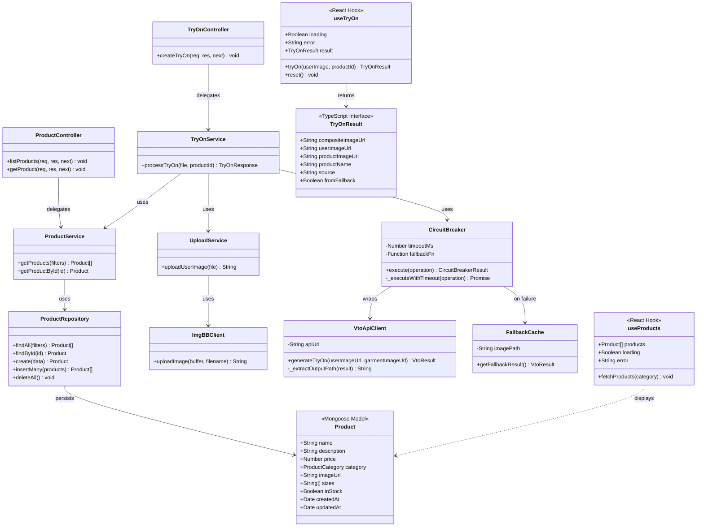

# Class Diagram — TryMe (Spiral 1)

Domain model, backend service layers, and key frontend types.

## Layer Summary

| Layer | Classes | Responsibility |
|-------|---------|----------------|
| **Domain** | `Product`, `TryOnResult` | Data shape for catalog and try-on responses |
| **Repository** | `ProductRepository` | MongoDB access |
| **Service** | `ProductService`, `UploadService`, `TryOnService` | Business logic and orchestration |
| **Infrastructure** | `ImgBBClient`, `VtoApiClient`, `FallbackCache`, `CircuitBreaker` | External APIs and resilience |
| **Controller** | `ProductController`, `TryOnController` | HTTP request handling |
| **Presentation** | `useProducts`, `useTryOn` | Frontend state and API integration |

[← Diagram index](README.md)
