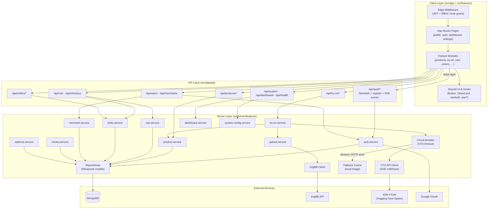

# Component Diagram — TryMe (Current)

Illustrates the unified Next.js App Router architecture: client features, Route Handlers, server feature layer, and external services.

## Layer Summary

| Layer | Location | Responsibility |
|-------|----------|----------------|
| **Client** | `src/app/`, `src/features/`, `src/shared/` | Pages, feature UI, shared primitives, i18n, theme |
| **Edge** | `src/middleware.ts` | JWT validation, role-based route access |
| **API** | `src/app/api/*/route.ts` | HTTP boundary, auth guards, request parsing |
| **Server** | `src/server/features/*/` | Business logic, orchestration, external integrations |
| **Infrastructure** | `src/server/lib/`, `src/server/db/` | Auth guards, API responses, DB connection, caching |
| **External** | MongoDB, ImgBB, Hugging Face, Google | Persistence, image hosting, AI try-on, OAuth |

[← Diagram index](README.md)
