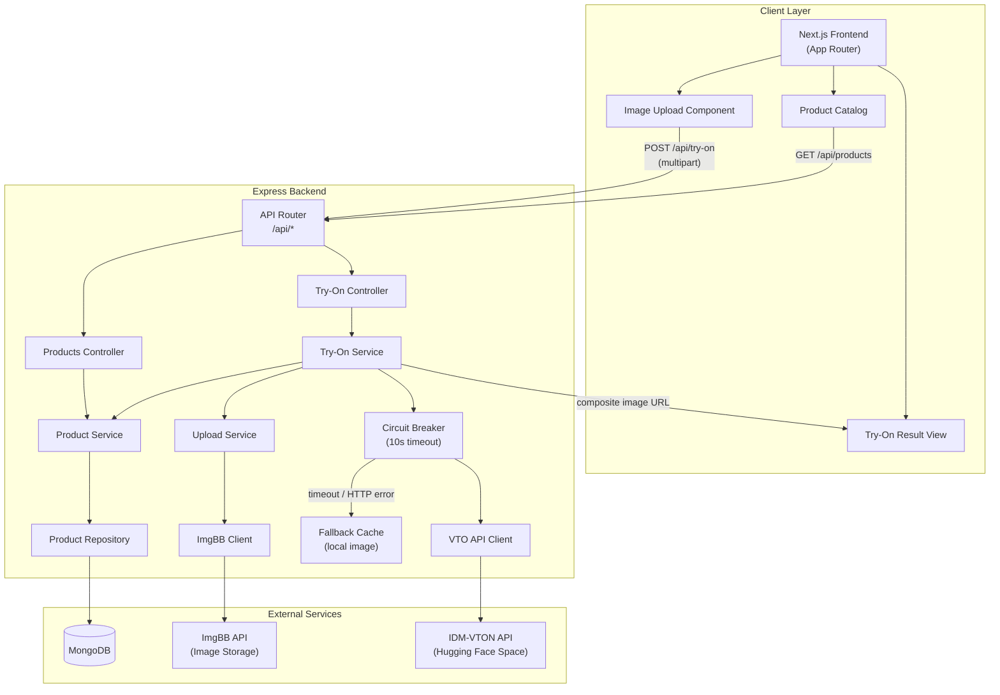

# Component Diagram — TryMe (Spiral 1)

Illustrates the structural wiring of the Next.js frontend, Express backend, MongoDB, ImgBB API, and VTO API.

```mermaid
graph TB
    subgraph Client["Client Layer"]
        UI["Next.js Frontend<br/>(App Router)"]
        Upload["Image Upload Component"]
        Catalog["Product Catalog"]
        Result["Try-On Result View"]
    end

    subgraph Server["Express Backend"]
        API["API Router<br/>/api/*"]
        ProductsCtrl["Products Controller"]
        TryOnCtrl["Try-On Controller"]
        ProductSvc["Product Service"]
        TryOnSvc["Try-On Service"]
        UploadSvc["Upload Service"]
        CB["Circuit Breaker<br/>(10s timeout)"]
        VTOClient["VTO API Client"]
        ImgBBClient["ImgBB Client"]
        Fallback["Fallback Cache<br/>(local image)"]
        ProductRepo["Product Repository"]
    end

    subgraph External["External Services"]
        MongoDB[("MongoDB")]
        ImgBB["ImgBB API<br/>(Image Storage)"]
        VTO["IDM-VTON API<br/>(Hugging Face Space)"]
    end

    UI --> Upload
    UI --> Catalog
    UI --> Result

    Upload -->|"POST /api/try-on<br/>(multipart)"| API
    Catalog -->|"GET /api/products"| API

    API --> ProductsCtrl
    API --> TryOnCtrl

    ProductsCtrl --> ProductSvc
    ProductSvc --> ProductRepo
    ProductRepo --> MongoDB

    TryOnCtrl --> TryOnSvc
    TryOnSvc --> UploadSvc
    TryOnSvc --> ProductSvc
    TryOnSvc --> CB

    UploadSvc --> ImgBBClient
    ImgBBClient --> ImgBB

    CB --> VTOClient
    CB -->|"timeout / HTTP error"| Fallback
    VTOClient --> VTO

    TryOnSvc -->|"composite image URL"| Result
```

[← Diagram index](diagrams.md)
