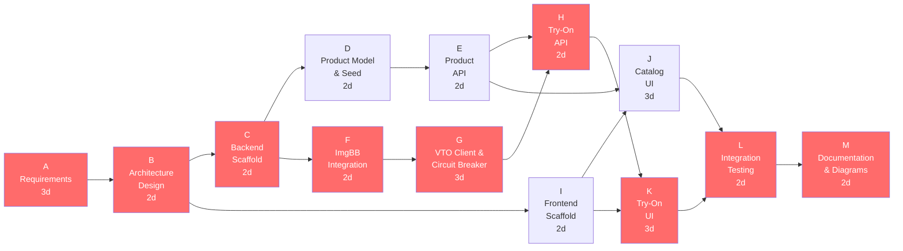

# Project Network Diagram (CPM) — TryMe Spiral 1

Activity-on-node network for the **Spiral 1 — Operational Prototype** delivery. Durations are working days.

## Task Table

| ID | Activity | Duration | Predecessors |
|----|----------|----------|--------------|
| A | Requirements & Spiral Planning | 3d | — |
| B | Architecture & Feature Design | 2d | A |
| C | Backend Scaffold (Express, config) | 2d | B |
| D | Product Model & MongoDB Seed | 2d | C |
| E | Product API (CRUD + routes) | 2d | D |
| F | ImgBB Integration | 2d | C |
| G | VTO Client & Circuit Breaker | 3d | F |
| H | Try-On API (orchestration) | 2d | E, G |
| I | Frontend Scaffold (Next.js) | 2d | B |
| J | Catalog UI (grid, filter) | 3d | E, I |
| K | Try-On UI (upload, result) | 3d | H, I |
| L | End-to-End Integration Testing | 2d | J, K |
| M | Documentation & Diagrams | 2d | L |

## CPM Analysis

| Metric | Value |
|--------|-------|
| **Project duration** | 21 working days |
| **Critical path** | A → B → C → F → G → H → K → L → M |
| **Total float (non-critical)** | D, E, I, J have slack (parallel branches) |

### Early / Late Schedule (selected milestones)

| Milestone | Early Start | Early Finish |
|-----------|-------------|--------------|
| Backend ready (C) | Day 5 | Day 7 |
| Try-On API (H) | Day 12 | Day 14 |
| UI complete (J, K) | Day 14 | Day 17 |
| Spiral 1 delivery (M) | Day 19 | Day 21 |

Red nodes in the diagram mark activities on the **critical path** — any delay on these tasks delays the entire Spiral 1 delivery.

[← Diagram index](diagrams.md)
