# Project Network Diagram (CPM) — TryMe Full Delivery

Activity-on-node network covering all four spirals delivered to date. Durations are working days.

```mermaid
flowchart LR
    subgraph S1["Spiral 1 — Operational Prototype"]
        A["A<br/>Requirements<br/>3d"] --> B["B<br/>Architecture<br/>Design<br/>2d"]
        B --> C["C<br/>Next.js<br/>Scaffold<br/>2d"]
        C --> D["D<br/>Product Model<br/>& Seed<br/>2d"]
        C --> F["F<br/>ImgBB<br/>Integration<br/>2d"]
        D --> E["E<br/>Product<br/>API<br/>2d"]
        F --> G["G<br/>VTO Client &<br/>Circuit Breaker<br/>3d"]
        E --> H["H<br/>Try-On<br/>API<br/>2d"]
        G --> H
        C --> I["I<br/>Catalog<br/>UI<br/>3d"]
        E --> I
        H --> K["K<br/>Try-On<br/>UI<br/>3d"]
        I --> K
    end

    subgraph S2["Spiral 2 — Auth & RBAC"]
        K --> L["L<br/>Auth.js<br/>Setup<br/>3d"]
        L --> M["M<br/>User Model<br/>& Permissions<br/>2d"]
        M --> N["N<br/>Middleware<br/>& Route Guards<br/>2d"]
        N --> O["O<br/>Role Dashboards<br/>4d"]
        O --> P["P<br/>Google OAuth<br/>2d"]
    end

    subgraph S3["Spiral 3 — Commerce"]
        P --> Q["Q<br/>Cart &<br/>Addresses<br/>3d"]
        Q --> R["R<br/>Checkout &<br/>Orders<br/>3d"]
        R --> S["S<br/>Reviews &<br/>Merchant Ops<br/>2d"]
        S --> T["T<br/>Dashboard<br/>Analytics<br/>2d"]
    end

    subgraph S4["Spiral 4 — Design & Polish"]
        T --> U["U<br/>Design System<br/>& Tokens<br/>3d"]
        U --> V["V<br/>UI Refactor<br/>(Astryx-informed)<br/>4d"]
        V --> W["W<br/>Settings &<br/>i18n<br/>2d"]
        W --> X["X<br/>VTO SSE Fix<br/>& Deploy<br/>2d"]
        X --> Y["Y<br/>Documentation<br/>& Diagrams<br/>2d"]
    end

    style A fill:#ff6b6b,color:#fff
    style B fill:#ff6b6b,color:#fff
    style C fill:#ff6b6b,color:#fff
    style F fill:#ff6b6b,color:#fff
    style G fill:#ff6b6b,color:#fff
    style H fill:#ff6b6b,color:#fff
    style K fill:#ff6b6b,color:#fff
    style L fill:#ff6b6b,color:#fff
    style M fill:#ff6b6b,color:#fff
    style N fill:#ff6b6b,color:#fff
    style O fill:#ff6b6b,color:#fff
    style Q fill:#ff6b6b,color:#fff
    style R fill:#ff6b6b,color:#fff
    style U fill:#ff6b6b,color:#fff
    style V fill:#ff6b6b,color:#fff
    style X fill:#ff6b6b,color:#fff
    style Y fill:#ff6b6b,color:#fff
```

## Task Table

| ID | Activity | Duration | Spiral | Predecessors |
|----|----------|----------|--------|--------------|
| A | Requirements & Spiral Planning | 3d | 1 | — |
| B | Architecture & Feature Design | 2d | 1 | A |
| C | Next.js Scaffold (unified App Router) | 2d | 1 | B |
| D | Product Model & MongoDB Seed | 2d | 1 | C |
| E | Product API (CRUD + routes) | 2d | 1 | D |
| F | ImgBB Integration | 2d | 1 | C |
| G | VTO Client & Circuit Breaker | 3d | 1 | F |
| H | Try-On API (orchestration) | 2d | 1 | E, G |
| I | Catalog UI (grid, filter) | 3d | 1 | C, E |
| K | Try-On UI (upload, result badge) | 3d | 1 | H, I |
| L | Auth.js Setup (NextAuth v5) | 3d | 2 | K |
| M | User Model & Permission Matrix | 2d | 2 | L |
| N | Middleware & API Route Guards | 2d | 2 | M |
| O | Role-Specific Dashboards (×6) | 4d | 2 | N |
| P | Google OAuth & Session Sync | 2d | 2 | O |
| Q | Cart & Addresses | 3d | 3 | P |
| R | Checkout & Orders (COD) | 3d | 3 | Q |
| S | Reviews & Merchant Operations | 2d | 3 | R |
| T | Dashboard Analytics | 2d | 3 | S |
| U | Design System & Semantic Tokens | 3d | 4 | T |
| V | UI Refactor (Astryx-informed) | 4d | 4 | U |
| W | Settings, Appearance & i18n | 2d | 4 | V |
| X | VTO SSE Fix & Vercel Deploy | 2d | 4 | W |
| Y | Documentation & Diagrams | 2d | 4 | X |

## CPM Analysis

| Metric | Value |
|--------|-------|
| **Total project duration** | 52 working days |
| **Critical path** | A → B → C → F → G → H → K → L → M → N → O → Q → R → U → V → X → Y |
| **Spiral 1 duration** | 21 days (A → K) |
| **Spiral 2 duration** | 13 days (L → P) |
| **Spiral 3 duration** | 10 days (Q → T) |
| **Spiral 4 duration** | 13 days (U → Y) |

### Parallel Branches (non-critical slack)

| Branch | Activities | Can run in parallel with |
|--------|-----------|--------------------------|
| Product API | D → E → I | ImgBB → VTO path (F → G) |
| Auth OAuth | P | Commerce prep |
| Reviews & Analytics | S, T | Design system planning |

Red nodes mark activities on the **critical path** — any delay on these tasks delays the full delivery.

[← Diagram index](diagrams.md)
