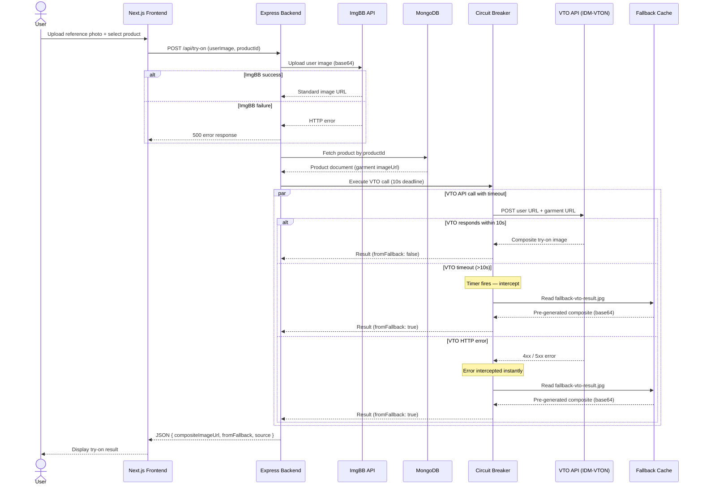

# Sequence Diagram — Circuit Breaker Flow

Maps the chronological data flow from user upload through ImgBB, VTO API call, timeout/error interception, and fallback cache serving.

[← Diagram index](diagrams.md)
