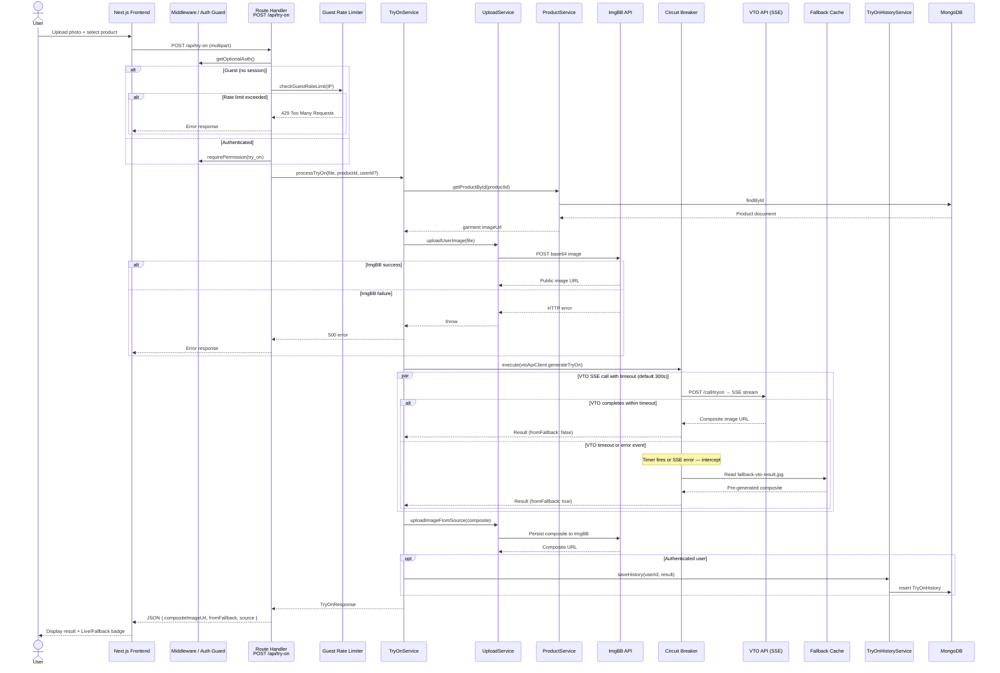

# Sequence Diagram — Virtual Try-On with Circuit Breaker

Maps the end-to-end try-on flow: guest rate limiting, image upload, SSE-based VTO call, circuit-breaker fallback, and history persistence.

## Key Resilience Points

| Point | Behavior |
|-------|----------|
| **Guest rate limit** | In-memory per-IP counter (default 3/hour from `SystemConfig`) |
| **Maintenance mode** | Blocks guest try-on; admins with `manage_system` bypass |
| **Circuit breaker** | Wraps VTO SSE call; timeout or error → local fallback image |
| **SSE error handling** | `event: error` always throws immediately (fail-fast to fallback) |
| **History** | Saved only for authenticated users with `try_on` permission |

[← Diagram index](README.md)
