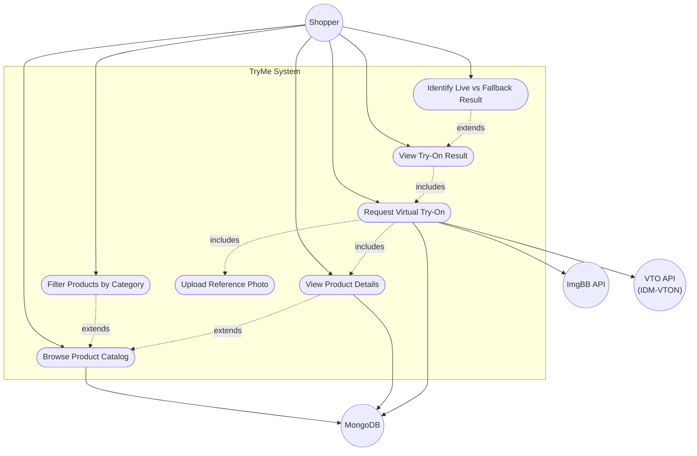

# Use Case Diagram — TryMe (Spiral 1)

Illustrates the actors and functional capabilities of the Virtual Try-On e-commerce prototype.

## Actors

| Actor | Role |
|-------|------|
| **Shopper** | Primary user who browses products and performs virtual try-on |
| **MongoDB** | Secondary actor — stores and serves product catalog data |
| **ImgBB API** | Secondary actor — hosts uploaded user reference photos |
| **VTO API** | Secondary actor — generates composite try-on images |

## Use Cases

| ID | Use Case | Description |
|----|----------|-------------|
| UC1 | Browse Product Catalog | Load and display all available products |
| UC2 | Filter Products by Category | Narrow catalog by tops, bottoms, dresses, etc. |
| UC3 | View Product Details | See name, price, description, and garment image |
| UC4 | Upload Reference Photo | Provide a personal photo for try-on |
| UC5 | Request Virtual Try-On | Submit photo + product to generate a composite image |
| UC6 | View Try-On Result | Display the composite image returned by the backend |
| UC7 | Identify Live vs Fallback Result | Show badge indicating VTO API or circuit-breaker fallback |

## Relationships

- **Include** — *Request Virtual Try-On* requires uploading a photo and resolving the selected product.
- **Extend** — *Filter by Category* and *View Product Details* extend catalog browsing; *Identify Live vs Fallback* extends result viewing.

[← Diagram index](diagrams.md)
