# Use Case Diagram — TryMe (Current)

Actors, use cases, and system boundaries across all delivered spirals.

```mermaid
flowchart TB
    Guest(("Guest"))
    Customer(("Customer"))
    Merchant(("Merchant"))
    Support(("Support Staff"))
    Admin(("Admin"))
    SuperAdmin(("Super Admin"))

    subgraph TryMe["TryMe System"]
        direction TB

        subgraph Catalog["Catalog & Try-On"]
            UC1(["Browse Product Catalog"])
            UC2(["Filter by Category"])
            UC3(["Virtual Try-On"])
            UC4(["View Try-On History"])
            UC5(["Identify Live vs Fallback"])
        end

        subgraph Commerce["Commerce"]
            UC6(["Manage Cart"])
            UC7(["Checkout (COD)"])
            UC8(["Track Orders"])
            UC9(["Write Product Review"])
            UC10(["Manage Addresses"])
        end

        subgraph Account["Account"]
            UC11(["Register / Sign In"])
            UC12(["Google OAuth"])
            UC13(["Manage Profile & Preferences"])
        end

        subgraph MerchantOps["Merchant Operations"]
            UC14(["Manage Products"])
            UC15(["View Merchant Analytics"])
            UC16(["Manage Store Profile"])
        end

        subgraph AdminOps["Administration"]
            UC17(["Manage Users & Roles"])
            UC18(["Manage Merchants"])
            UC19(["View Platform Stats"])
            UC20(["System Config & Maintenance"])
            UC21(["Assume Role (Super Admin)"])
        end
    end

    ImgBB(("ImgBB API"))
    VTO(("VTO API"))
    MongoDB(("MongoDB"))
    Google(("Google OAuth"))

    Guest --> UC1
    Guest --> UC2
    Guest --> UC3
    Guest --> UC11

    Customer --> UC1
    Customer --> UC3
    Customer --> UC4
    Customer --> UC6
    Customer --> UC7
    Customer --> UC8
    Customer --> UC9
    Customer --> UC10
    Customer --> UC11
    Customer --> UC12
    Customer --> UC13

    Merchant --> UC14
    Merchant --> UC15
    Merchant --> UC16
    Merchant --> UC8

    Support --> UC4
    Support --> UC8
    Support --> UC17
    Support --> UC19

    Admin --> UC17
    Admin --> UC18
    Admin --> UC19
    Admin --> UC20

    SuperAdmin --> UC21

    UC2 -.->|extends| UC1
    UC5 -.->|extends| UC3
    UC7 -.->|includes| UC6
    UC9 -.->|includes| UC8
    UC12 -.->|extends| UC11

    UC1 --> MongoDB
    UC3 --> ImgBB
    UC3 --> VTO
    UC3 --> MongoDB
    UC7 --> MongoDB
    UC11 --> MongoDB
    UC12 --> Google
```

## Actors

| Actor | Role |
|-------|------|
| **Guest** | Anonymous visitor; browse catalog, rate-limited try-on (3/hour) |
| **Customer** | Registered shopper; full try-on, cart, checkout, orders, reviews |
| **Merchant** | Store owner; manage products, view analytics, fulfill orders |
| **Support Staff** | User lookup, order support, try-on history inspection |
| **Admin** | User/merchant management, platform health |
| **Super Admin** | All admin capabilities + role assumption for testing |
| **MongoDB** | Secondary actor — persistent data store |
| **ImgBB API** | Secondary actor — image hosting |
| **VTO API** | Secondary actor — AI composite generation |
| **Google OAuth** | Secondary actor — social sign-in |

## Use Case Summary by Spiral

| Spiral | Use Cases Delivered |
|--------|-------------------|
| **Spiral 1** | UC1–UC5 (catalog + VTO + fallback badge) |
| **Spiral 2** | UC11–UC13, UC17–UC21 (auth, RBAC, dashboards) |
| **Spiral 3** | UC6–UC10, UC14–UC16 (commerce + merchant ops) |
| **Spiral 4** | UC13 enhanced (appearance, i18n, theme preferences) |

[← Diagram index](diagrams.md)
