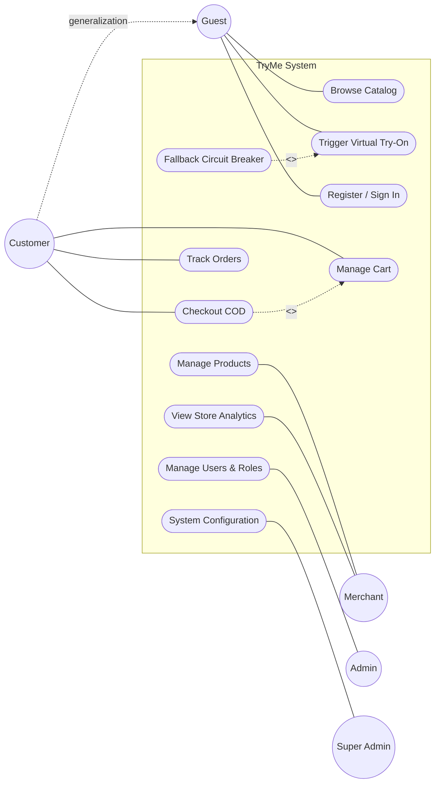

# Use Case Diagram — TryMe

Behavioral UML (who interacts × what goals). **Defense source of truth is Draw.io**, not Mermaid.

## Open this for the panel slide

**[tryme-use-case-diagram.drawio](drawio/tryme-use-case-diagram.drawio)** — page size **1100×411** (11″ wide × 4.11″ tall).

| Rule | Implementation in the `.drawio` |
|------|----------------------------------|
| One system boundary | Single rectangle labeled **TryMe System** (no nested boxes) |
| Actors | `umlActor` stick figures outside the boundary |
| Use cases | UML **ellipses** inside the boundary |
| Associations | Solid lines, **no** arrowheads |
| `<<include>>` | Dashed + open V: Checkout COD → Manage Cart |
| `<<extend>>` | Dashed + open V: Fallback Circuit Breaker → Trigger Virtual Try-On |
| Generalization | Customer → Guest (hollow triangle toward Guest) |
| RBAC split | Admin → Manage Users & Roles; Super Admin → System Configuration |

### Export for PowerPoint

1. Open the `.drawio` in [diagrams.net](https://app.diagrams.net/) or the Draw.io desktop/VS Code extension.
2. **File → Export as → PNG** (or SVG) with **transparent background**.
3. Insert into the 11″ × 4.11″ slide slot.

## Mermaid (reference / Copy Mermaid only)

Mermaid cannot render stick figures or true UML ellipses. The HTML page remains a **sketch** for structure checks. Prefer the `.drawio` for the defense.

Interactive sketch: [html/use-case-diagram.html](html/use-case-diagram.html)

```mermaid
flowchart LR
    Guest(("Guest"))
    Customer(("Customer"))
    Customer -.->|generalization| Guest

    subgraph TryMe["TryMe System"]
        direction LR
        UC1(["Browse Catalog"])
        UC2(["Trigger Virtual Try-On"])
        UC3(["Fallback Circuit Breaker"])
        UC4(["Register / Sign In"])
        UC5(["Manage Cart"])
        UC6(["Checkout COD"])
        UC7(["Track Orders"])
        UC8(["Manage Products"])
        UC9(["View Store Analytics"])
        UC10(["Manage Users & Roles"])
        UC11(["System Configuration"])
    end

    Merchant(("Merchant"))
    Admin(("Admin"))
    SuperAdmin(("Super Admin"))

    Guest --- UC1
    Guest --- UC2
    Guest --- UC4
    Customer --- UC5
    Customer --- UC6
    Customer --- UC7
    UC8 --- Merchant
    UC9 --- Merchant
    UC10 --- Admin
    UC11 --- SuperAdmin
    UC6 -.->|<<include>>| UC5
    UC3 -.->|<<extend>>| UC2
```

[← Diagram index](README.md)
