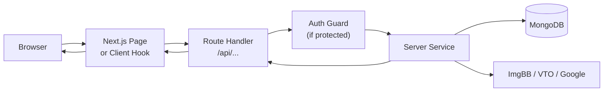

# How TryMe Works

A plain-language guide to what TryMe does, who can do what, and what happens behind the scenes when you use the site.

---

## What Is TryMe?

TryMe is a virtual try-on e-commerce web app. You browse clothing and accessories, upload a photo of yourself, and the app generates a composite image showing how an item might look on you. You can also add items to a cart, check out, and track orders — like a normal online store, with try-on as the standout feature.

The app runs as a single **Next.js** site: pages and API live in one codebase, backed by **MongoDB** for data, **ImgBB** for image hosting, and a **Hugging Face** AI space for try-on generation.

---

## Site Map

| Area | Routes | Who can access |
|------|--------|----------------|
| **Storefront** | `/` | Everyone (guests and signed-in users) |
| **Auth** | `/login`, `/register` | Everyone |
| **Cart & checkout** | `/cart`, `/checkout` | Signed-in users only |
| **Order detail** | `/orders/[id]` | Signed-in users (own orders; staff can see more via API) |
| **Dashboards** | `/dashboard/customer`, `/dashboard/merchant`, etc. | Signed-in users (role-specific) |
| **Settings** | `/settings/profile`, `/settings/appearance`, … | Signed-in users |

The global **Header** is always visible: logo, catalog link, cart (when signed in), and account menu.

---

## User Roles

TryMe has six roles. What you see and do depends on your role.

| Role | Typical user | Main capabilities |
|------|----------------|-------------------|
| **Guest** | Visitor, not signed in | Browse catalog, try-on up to 3 times per hour |
| **Customer** | Registered shopper | Full try-on, cart, checkout, orders, addresses, try-on history |
| **Merchant** | Store owner | Manage own products, view store analytics, fulfill orders |
| **Support Staff** | Help desk | Look up users and orders, view try-on history |
| **Admin** | Platform manager | Manage users, merchants, system health |
| **Super Admin** | Top-level admin | Everything above + assign roles, assume another role for testing |

**Demo accounts** (in-memory DB only): all use password `TryMe123!` — e.g. `customer@tryme.local`, `merchant@tryme.local`, `admin@tryme.local`.

Sign-in options: **email + password** or **Google OAuth**.

---

## Main User Journeys

### 1. Browse the catalog (anyone)

1. Open `/` — the home page loads products from the database.
2. Use category filters (tops, bottoms, dresses, etc.) to narrow the grid.
3. Each product card shows image, name, price, and actions: **Try On** and **Add to Cart** (cart requires sign-in).

Products are loaded on the server for fast first paint; filters can refresh the list on the client.

### 2. Virtual try-on (guest or customer)

This is the core flow:

1. Click **Try On** on a product → a modal opens.
2. Upload a reference photo (your face/body).
3. Submit → the app sends your image and the product ID to the backend.

**What the backend does:**

1. Loads the product’s garment image from MongoDB.
2. Uploads your photo to **ImgBB** and gets a public URL.
3. Sends your URL + garment URL to the **VTO API** (IDM-VTON on Hugging Face) via an SSE stream.
4. If the AI responds in time → you get a **Live** composite image.
5. If the API times out or errors → a **Fallback** cached composite is shown instead (circuit breaker — the request never “hangs” forever).
6. The composite is stored on ImgBB; signed-in users get an entry in **try-on history**.

The result screen shows a **Live** or **Fallback** badge so you know which path was used.

**Guests:** limited to 3 try-ons per hour per IP (configurable). **Maintenance mode** blocks guest try-on; admins can still use the system.

### 3. Sign up and sign in

- **Register** at `/register` → creates a **Customer** account.
- **Login** at `/login` → JWT session via Auth.js; session includes role and permissions.
- After login, protected routes (`/cart`, `/checkout`, `/dashboard`, `/settings`) are allowed; middleware redirects guests to login with a return URL.

### 4. Cart and checkout (customer)

1. **Add to cart** from the catalog (size/custom options if the product has them).
2. Open **Cart** at `/cart` — view lines, change quantities, remove items.
3. **Checkout** at `/checkout` — pick or enter a shipping address, confirm order.
4. Payment is **Cash on Delivery (COD)** only today; order is created as pending payment.
5. Cart is cleared; you’re sent to the order page.

Stock is checked when adding to cart and again at checkout; placing an order reduces inventory.

### 5. Orders and reviews (customer)

- View orders on the customer dashboard (`/dashboard/customer` → Orders section) or at `/orders/[id]`.
- Order status progresses: pending → confirmed → processing → shipped → delivered (or cancelled).
- After **delivered**, you can leave a **review** (rating + comment) for products you bought.

### 6. Merchant workflow

Merchants use `/dashboard/merchant`:

- **Products** — create, edit, delete their own listings (images, price, sizes, custom fields, stock).
- **Orders** — see orders that include their items; update per-item merchant status.
- **Analytics** — try-on and product stats for their store.
- **Store** — update merchant profile (name, description, etc.).

### 7. Admin and support

- **Support** — user lookup, order visibility, try-on history (read-focused).
- **Admin** — user/merchant management, platform stats, health checks.
- **Super Admin** — role assignment, system config (maintenance mode, guest try-on limit), and **role assumption** (act as another role without logging out).

---

## How a Request Flows Through the App

When you click something in the browser, this is the general path:

- **Pages** render UI and call **API routes** (same origin, `/api/*`).
- **Route Handlers** validate auth/permissions, then call **services**.
- **Services** hold business logic and talk to **repositories** (database) or **external APIs**.
- Responses are JSON with a consistent shape: `{ success, data?, error? }`.

**Edge middleware** runs before some pages (`/cart`, `/checkout`, `/dashboard`, `/settings`, `/orders/*`): it checks your JWT and role, redirects to login if needed, and sends you to the right dashboard for your role.

---

## Authentication in Short

- Sessions are **JWT-based** (Auth.js / NextAuth v5).
- Each API route that needs protection calls `requireAuth()` or `requirePermission('some_permission')`.
- Permissions are granular (e.g. `try_on`, `manage_cart`, `place_orders`, `manage_products`) and mapped to roles in one central matrix.
- Role changes in the database sync to your session within about 15 seconds.
- **Auth events** (SSE at `/api/auth/events`) can notify open tabs when session state changes.

---

## Data the App Stores

| Data | Purpose |
|------|---------|
| **Users** | Accounts, roles, preferences (theme, language, fonts) |
| **Products** | Catalog items, linked to a merchant |
| **Merchants** | Store profiles and approval status |
| **Carts** | One cart per user, line items with size/options |
| **Orders** | Order number, items, shipping, status, COD payment state |
| **Addresses** | Saved shipping addresses |
| **Reviews** | Post-delivery ratings tied to product + order |
| **Try-on history** | Past try-on results for signed-in users |
| **System config** | Maintenance mode, guest try-on limit |

Local development can use an **in-memory MongoDB** with auto-seeded demo products and users — no install required.

---

## External Services

| Service | Role |
|---------|------|
| **MongoDB** | All persistent app data |
| **ImgBB** | Hosts uploaded user photos and try-on composite images |
| **Hugging Face (IDM-VTON)** | AI virtual try-on; called via SSE `/call/tryon` |
| **Google OAuth** | Optional sign-in provider |
| **Vercel** | Production hosting (serverless API + static/SSR pages) |

If Hugging Face is slow or unavailable, the **circuit breaker** serves a local fallback image so the demo still completes.

---

## Settings and Personalization

Signed-in users open **Settings** from the header:

| Page | What you can change |
|------|---------------------|
| **Profile** | Name and profile fields |
| **Account** | Email/password-related account info |
| **Appearance** | Light/dark/system theme, color scheme, fonts, motion, card tilt |
| **Language** | English or Bengali (UI strings via i18n) |

Preferences are saved to your user record and applied on the next load (theme boot script avoids flash of wrong theme).

---

## UI Structure (What You See)

TryMe uses a **liquid glass** look: sand/olive/clay colors, frosted cards, Urbanist + Cormorant fonts.

Layout depends on where you are:

- **Catalog** — top navigation + product **card grid**.
- **Cart / checkout / auth** — narrower column, forms grouped in **cards**.
- **Dashboards** — **sidebar** (~256px) + main content; dense lists (orders, users) use **rows**, KPIs and widgets use **cards**.

Details: [design/design.md](design/design.md).

---

## Environment and Deployment

- **Local:** `npm run dev` → `http://localhost:3000`; configure `.env.local` (see README).
- **Production:** Deployed on Vercel; needs `AUTH_SECRET`, `MONGODB_URI`, and public URL vars set correctly.

Important env knobs:

- `USE_IN_MEMORY_DB` — local dev without MongoDB install
- `VTO_API_URL` / `VTO_TIMEOUT_MS` — try-on API endpoint and circuit breaker timeout
- `IMGBB_API_KEY` — image uploads
- `HF_TOKEN` — optional; better Hugging Face rate limits

---

## Quick Reference: Common Questions

**Why do I sometimes see “Fallback” on try-on?**  
The live AI service didn’t respond in time or returned an error. The app deliberately shows a cached composite so the feature still works — core to the Spiral 1 resilience design.

**Why can’t I add to cart as a guest?**  
Cart and checkout require an account so orders and addresses tie to a user.

**Where is the “backend”?**  
There is no separate Express server. API logic lives in `src/app/api/*/route.ts` and `src/server/features/`.

**How do merchants get products on the site?**  
Admins approve merchants; merchants create products from their dashboard. Seed data populates sample products in dev.

---

## Related Documentation

| Document | Contents |
|----------|----------|
| [README](../README.md) | Setup, env vars, API list, demo accounts |
| [SDLC Model](sdlc-model.md) | How the project was built in spirals |
| [SWE Model](swe-model.md) | Architecture layers and patterns |
| [Diagram Index](diagrams/diagrams.md) | Component, sequence, use case, and other diagrams |
| [Design System](design/design.md) | UI rules and tokens |

[← Documentation index](diagrams/diagrams.md)
