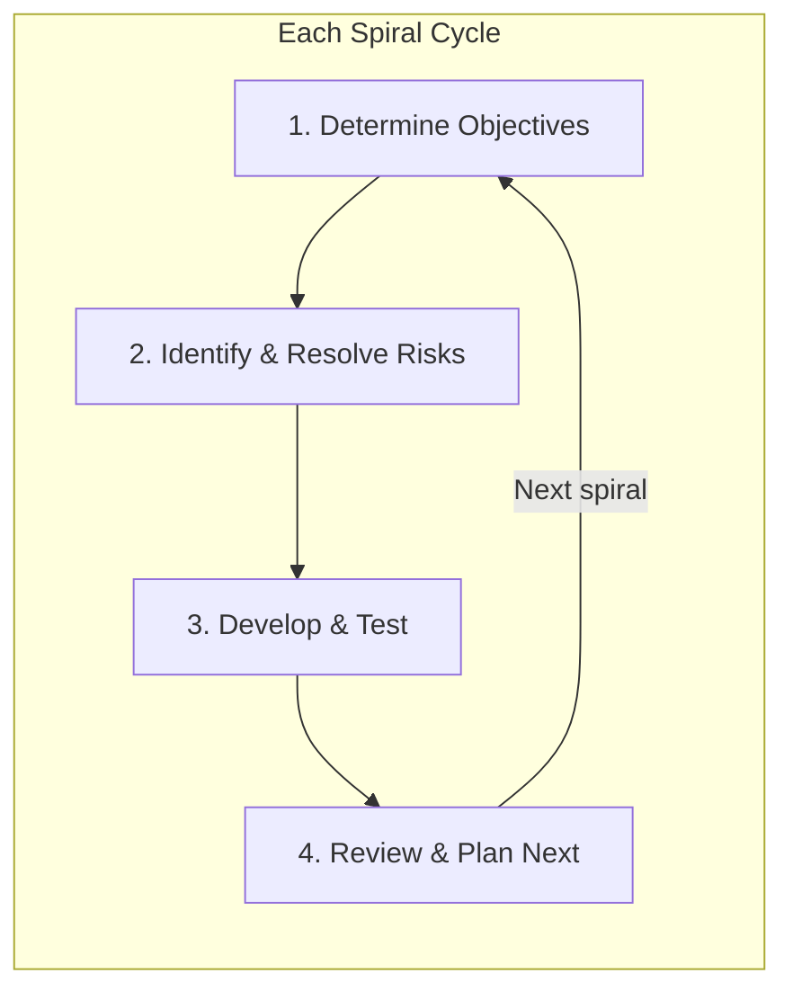
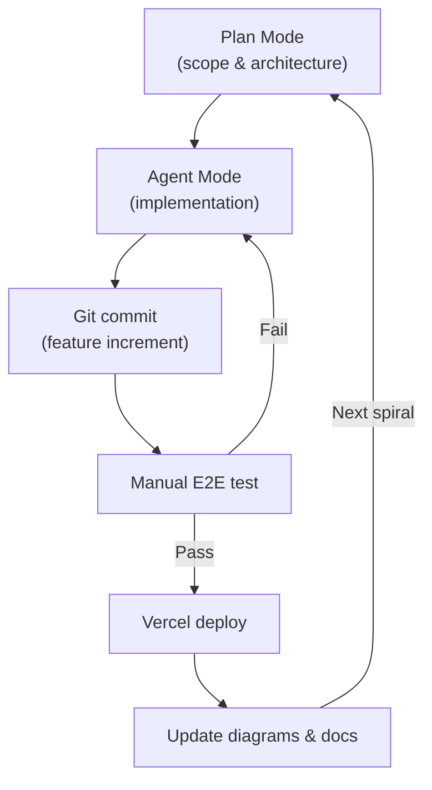

# SDLC Model — TryMe

How TryMe was planned, built, and evolved. This document describes the **actual process** followed during development, not a generic textbook model.

---

## Overview

TryMe uses the **Spiral Model** (Evolutionary Prototyping) as its Software Development Life Cycle. Each spiral delivers a working, deployable increment of the product. Risk is addressed early (VTO API resilience in Spiral 1), and scope expands only after the previous increment is validated.

---

## Spirals Delivered

| Spiral | Name | Duration | Outcome |
|--------|------|----------|---------|
| **1** | Operational Prototype | ~21 days | End-to-end VTO workflow, product catalog, circuit-breaker fallback |
| **2** | Auth & RBAC | ~13 days | Auth.js, 6 roles, 21 permissions, role-specific dashboards |
| **3** | Commerce | ~10 days | Cart, checkout (COD), orders, addresses, reviews, merchant ops |
| **4** | Design & Polish | ~13 days | Design system, Astryx-informed UI, settings/i18n, VTO SSE fix, Vercel deploy |

See [project-network-diagram.md](diagrams/project-network-diagram.md) for the full CPM schedule.

---

## Process Per Spiral

Each spiral followed the same four-phase cycle:

### Phase 1 — Determine Objectives

- Define what the spiral must deliver (user stories, acceptance criteria).
- Scope is **fixed per spiral** — features outside scope are deferred to the next spiral.
- Example (Spiral 1): "A shopper can browse products and receive a try-on result, even when the VTO API is down."

**How we did it:**
- Started with README requirements and course constraints (free-tier APIs only).
- Used Cursor **Plan Mode** for large features (auth RBAC, design refactor) to agree on scope before coding.
- Documented actors and use cases in [use-case-diagram.md](diagrams/use-case-diagram.md) at spiral start.

### Phase 2 — Identify & Resolve Risks

- Prototype the highest-risk component first.
- Spiral 1 risk: VTO API latency, rate limits, and downtime → **Circuit Breaker + Fallback Cache**.
- Spiral 2 risk: Role complexity → **Centralized permission matrix** before building dashboards.
- Spiral 4 risk: Hugging Face Gradio upgrade killed sync `/api/predict` → **SSE `/call/tryon` rewrite**.

**How we did it:**
- Built the circuit breaker before the try-on UI.
- Implemented auth guards and middleware before role dashboards.
- When the public VTO Space changed its API, we patched the SSE client and embraced Fallback as a demo feature rather than chasing guaranteed Live results on a free tier.

### Phase 3 — Develop & Test

- Feature-based vertical slices: model → repository → service → route handler → client hook → UI.
- One commit per logical feature increment.
- Manual end-to-end testing after each slice; no separate QA phase.

**How we did it:**
- Cursor **Agent Mode** for implementation; human review of diffs.
- In-memory MongoDB with auto-seed for zero-setup local dev.
- Demo accounts for every role (password: `TryMe123!`).
- Deployed to Vercel for production validation.

### Phase 4 — Review & Plan Next

- Evaluate the working prototype against spiral objectives.
- Update diagrams and README to reflect current state.
- Define the next spiral's scope based on gaps and priorities.

**How we did it:**
- README "Spiral Model Notes" section updated per spiral.
- Diagrams refreshed at project milestones (this document set).
- Deferred items explicitly noted: Stripe payments, enhanced VTO params, automated tests.

---

## Key SDLC Decisions

| Decision | Rationale |
|----------|-----------|
| **Spiral over Waterfall** | VTO API behavior was unknown; needed working prototype before investing in commerce/auth |
| **Spiral over Agile sprints** | Course/project structure maps to discrete deliverable increments, not continuous 2-week sprints |
| **AI-assisted development (Cursor)** | Faster iteration on boilerplate; human owns architecture, scope, and review |
| **Documentation alongside code** | Diagrams created at spiral boundaries, not deferred to end |
| **Deploy early** | Vercel deployment in Spiral 4 caught env/auth issues that localhost hid |
| **Embrace constraints** | Free Hugging Face Space → Fallback is a feature, not a bug |

---

## Tooling & Workflow

| Tool | Role in SDLC |
|------|-------------|
| **Cursor IDE** | Primary development environment; Plan + Agent modes |
| **Git** | Version control; one feature per commit |
| **GitHub** | Remote repository |
| **Vercel** | Production deployment and env validation |
| **MongoDB** | Persistent data (in-memory for local dev) |
| **Mermaid** | Architecture and process diagrams in Markdown |
| **ImgBB + Hugging Face** | External service integrations (free tier) |

---

## Spiral Exit Criteria

Each spiral was considered complete when:

1. All planned use cases were functional end-to-end.
2. The app built and ran without errors (`npm run build`).
3. README and diagrams reflected the current architecture.
4. Known risks for the next spiral were identified.

---

## Future Spirals (Planned)

| Spiral | Scope |
|--------|-------|
| **5** | Stripe payment integration, order payment flow |
| **6** | Enhanced VTO (garment category params, multi-angle) |
| **7** | Automated testing (unit + E2E), CI pipeline |
| **8** | Performance optimization, caching strategy |

---

## Related Documents

- [SWE Model](swe-model.md) — Engineering architecture and patterns
- [Diagram Index](diagrams/README.md) — All architecture diagrams
- [Design System](design/design.md) — UI rules and tokens
- [README](../README.md) — Project overview and quick start

[← Documentation index](README.md)
