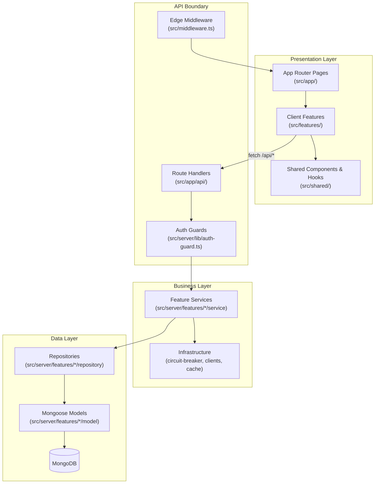

# SWE Model — TryMe

The software engineering model, architecture patterns, and conventions used to build TryMe. This document describes **what we built and how**, grounded in the actual codebase.

---

## Architecture Style

**Unified Next.js Monolith** — a single Next.js 15 App Router application where UI pages and API Route Handlers coexist. There is no separate Express or microservice backend.



---

## Layered Architecture

Every feature follows the same layered pattern:

```
Route Handler  →  Service  →  Repository  →  Model (Mongoose)
     ↑                ↑
  Auth Guard     External Clients
  (permission)   (ImgBB, VTO, etc.)
```

| Layer | Location | Rules |
|-------|----------|-------|
| **Route Handler** | `src/app/api/*/route.ts` | Parse HTTP, call auth guard, invoke service, return JSON. No business logic. |
| **Service** | `src/server/features/*/service.ts` | Business logic, orchestration, validation. Calls repositories and external clients. |
| **Repository** | `src/server/features/*/repository.ts` | MongoDB CRUD only. No business rules. |
| **Model** | `src/server/features/*/model.ts` | Mongoose schema definition. |
| **Client Feature** | `src/features/*/` | React hooks, API wrappers, UI components for one domain. |
| **Shared** | `src/shared/` | Cross-cutting types, UI primitives, auth helpers, i18n. |

### Example: Try-On Feature

```
src/features/try-on/          ← Client (TryOnModal, useTryOn, try-on.api.ts)
src/app/api/try-on/route.ts   ← Route Handler (POST, auth, multipart parse)
src/server/features/try-on/
  ├── try-on.service.ts       ← Orchestration (upload → VTO → persist → history)
  ├── vto-api.client.ts       ← External SSE client
  ├── circuit-breaker.ts      ← Resilience wrapper
  └── try-on-history.service.ts
```

---

## Feature-Based Organization

Code is grouped by **domain feature**, not by file type:

```
src/
├── app/                    # Routes (pages + API)
│   ├── (public)/           # Catalog, cart, checkout, orders
│   ├── (auth)/             # Login, register
│   ├── (dashboard)/        # Role-specific dashboards
│   ├── (settings)/         # User settings
│   └── api/                # Route Handlers
├── features/               # Client-side feature modules
│   ├── products/
│   ├── try-on/
│   ├── cart/
│   ├── orders/
│   └── ...
├── server/features/        # Server-side feature modules
│   ├── products/
│   ├── try-on/
│   ├── cart/
│   ├── orders/
│   └── ...
└── shared/                 # Cross-cutting concerns
    ├── types/              # End-to-end TypeScript contracts
    ├── auth/               # Roles, permissions, navigation
    ├── components/         # UI primitives
    └── hooks/              # Shared React hooks
```

**Rule:** Client features mirror server features. Shared types in `src/shared/types/` are the contract between both sides.

---

## Design Patterns Used

### 1. Circuit Breaker (VTO Resilience)

Wraps the external VTO API call with a timeout. On failure, serves a pre-cached fallback image instantly.

```
TryOnService → CircuitBreaker.execute(vtoApiClient.generateTryOn)
                 ├── success → live composite
                 └── timeout/error → FallbackCache.getFallbackResult()
```

- Configurable timeout (`VTO_TIMEOUT_MS`, default 300s)
- SSE-based VTO client (`/call/tryon` → stream until `complete`)
- Fail-fast on `event: error` in SSE stream
- Result always includes `fromFallback: boolean` for UI badge

### 2. Repository Pattern

Each Mongoose model has a dedicated repository class with typed CRUD methods. Services never import Mongoose directly.

```typescript
// product.repository.ts
export const productRepository = {
  findAll(filters) { ... },
  findById(id) { ... },
  create(data) { ... },
};
```

### 3. Auth Guard (RBAC)

Centralized permission checks used by every protected Route Handler:

```typescript
// Route Handler
const session = await requirePermission('manage_products');
// or
const session = await getOptionalAuth(); // guest-allowed endpoints
```

- 6 roles: Guest, Customer, Merchant, Support, Admin, Super Admin
- 21 granular permissions mapped per role
- JWT sessions with 15s DB sync for role changes
- Super Admin can assume any role for testing

### 4. Guest Rate Limiting

In-memory per-IP counter for anonymous try-on requests. Limit configurable via `SystemConfig.guestTryOnLimit` (default 3/hour).

### 5. Feature-Based Client Hooks

Each client feature exposes a React hook that encapsulates API calls and state:

| Hook | Feature | State managed |
|------|---------|---------------|
| `useProducts` | Catalog | products, loading, error, category filter |
| `useTryOn` | Try-on | result, loading, error, abort |
| `useCart` | Cart | items, add/update/remove, loading |
| `useAuth` | Auth | session, hasPermission, role |

### 6. Shared Type Contracts

All domain types live in `src/shared/types/index.ts`. Both client and server import from here — no duplicate type definitions.

---

## Cross-Cutting Concerns

| Concern | Implementation |
|---------|---------------|
| **Authentication** | Auth.js (NextAuth v5), JWT, Google OAuth + Credentials |
| **Authorization** | Permission matrix in `src/shared/auth/permissions.ts`, enforced in Route Handlers and middleware |
| **Error handling** | `AppError` class + `jsonError()` / `jsonSuccess()` helpers |
| **Caching** | `unstable_cache` wrapper for product queries; in-memory guest rate limit |
| **Image storage** | ImgBB API for user uploads and composite persistence |
| **Internationalization** | `src/shared/i18n/` — English + Bengali message catalogs |
| **Theming** | CSS custom properties + user preferences (theme, color scheme, fonts, motion) |
| **Real-time auth** | SSE event bus (`/api/auth/events`) for session change notifications |

---

## Design System Engineering

UI follows a **design contract** approach rather than importing external component libraries:

| Principle | Implementation |
|-----------|---------------|
| **Semantic tokens** | CSS vars (`--color-body`, `--color-primary`, …) in `globals.css` |
| **Brand palette** | Sand / olive / clay earth tones + liquid glass |
| **Frame-first layout** | AppShell (dashboards), TopNav (catalog), narrow column (forms) |
| **Cards vs rows** | Cards for widgets/gallery; rows for dense data lists |
| **No external UI lib** | Custom primitives in `src/shared/components/` |
| **Astryx-informed structure** | Conventions absorbed from Meta Astryx docs; packages not installed |
| **Agent rules** | `.cursor/rules/tryme-design.mdc` enforces design contract in AI-assisted development |

Full rules: [design/design.md](design/design.md)

---

## API Design Conventions

| Convention | Example |
|------------|---------|
| RESTful Route Handlers | `GET/POST /api/products`, `PATCH /api/orders/[id]/status` |
| Consistent response shape | `{ success: boolean, data?: T, error?: string }` |
| Auth on every protected route | `requireAuth()` or `requirePermission()` at top of handler |
| Public routes explicitly unguarded | `GET /api/products`, `GET /api/system/status` |
| Multipart for file uploads | `POST /api/try-on` (userImage file + productId) |
| Query params for filtering | `GET /api/products?category=tops&inStock=true` |

---

## Database Design

| Model | Collection | Key relationships |
|-------|-----------|-------------------|
| User | `users` | → Merchant (via merchantId), → Cart (1:1), → Orders (1:N) |
| Product | `products` | → Merchant (via merchantId) |
| Merchant | `merchants` | → User (via ownerId) |
| Cart | `carts` | → User (1:1, unique userId) |
| Order | `orders` | → User, embedded items with merchantStatus |
| Address | `addresses` | → User (1:N) |
| Review | `reviews` | → User + Product + Order (unique triple) |
| TryOnHistory | `tryonhistories` | → User (optional) + Product |
| SystemConfig | `systemconfigs` | Singleton config document |

**Dev convenience:** In-memory MongoDB with auto-seed (`USE_IN_MEMORY_DB=true`) provides instant local setup with demo data for all roles.

---

## Deployment Model

| Environment | Platform | Notes |
|-------------|----------|-------|
| **Local dev** | `npm run dev` | In-memory DB, localhost:3000 |
| **Production** | Vercel | Serverless Route Handlers, env vars in Vercel dashboard |
| **Database** | MongoDB Atlas (or local) | Connection via `MONGODB_URI` |

Key env considerations:
- `AUTH_SECRET` required on Vercel
- `AUTH_URL` left unset on Vercel (auto-detect)
- `NEXT_PUBLIC_SITE_URL` must match deployed origin
- Redeploy after changing public env vars

---

## Engineering Principles

These principles guided every implementation decision:

1. **Minimize scope** — Smallest correct diff per commit; no unrelated changes.
2. **Match existing conventions** — New code reads as if written by the same author.
3. **Feature slices over horizontal layers** — Build one feature end-to-end before starting the next.
4. **Resilience by design** — External APIs (VTO, ImgBB) wrapped with fallbacks and timeouts.
5. **Types as contracts** — Shared types prevent client/server drift.
6. **Documentation at spiral boundaries** — Diagrams and docs updated when architecture changes, not after.
7. **Constraints as features** — Free-tier API limits shaped the Fallback demo narrative.

---

## Related Documents

- [SDLC Model](sdlc-model.md) — How we planned and delivered each spiral
- [Diagram Index](diagrams/diagrams.md) — All architecture diagrams
- [Component Diagram](diagrams/component-diagram.md) — Structural wiring
- [Class Diagram](diagrams/class-diagram.md) — Domain model and layers
- [Design System](design/design.md) — UI rules and tokens

[← Documentation index](diagrams/diagrams.md)
